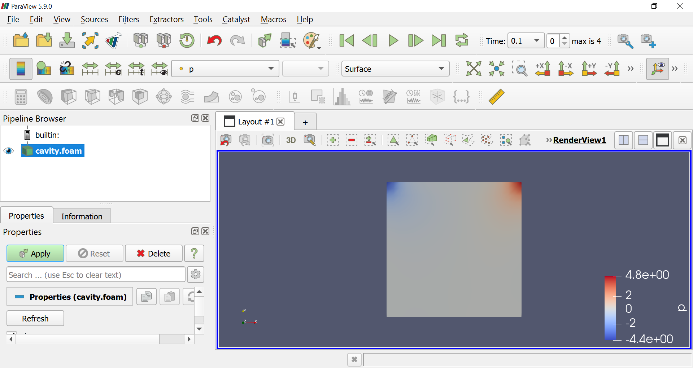
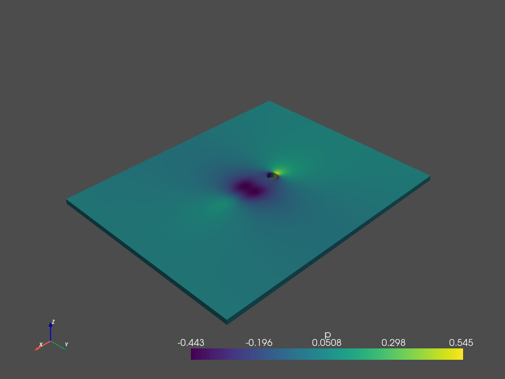
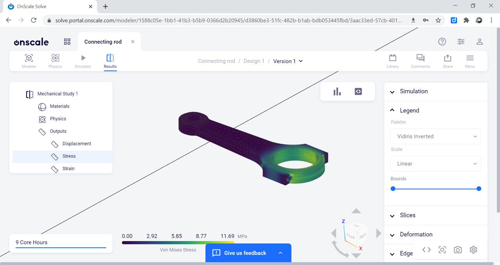
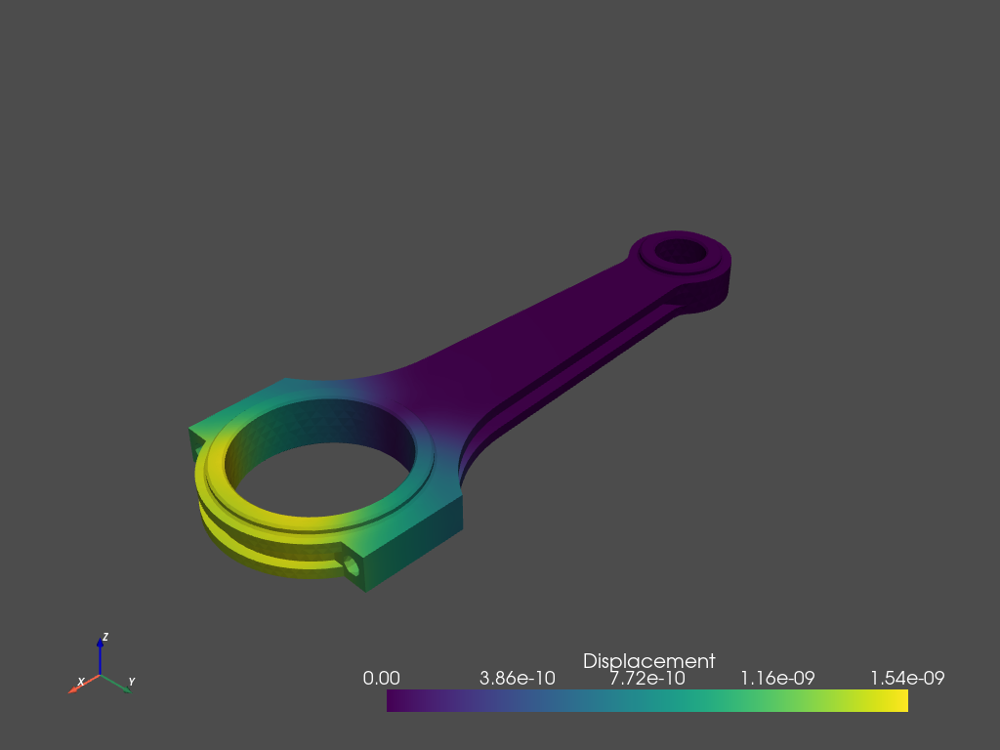

# Sim AI 🤖

Run AI on Simulation data


## OpenFOAM

### [Get started](https://www.openfoam.com/download/install-windows-10.php)

```
mkdir -p /mnt/c/Users/<USER>/tutorial
cd /mnt/c/Users/<USER>/tutorial
cp -ar $FOAM_TUTORIALS/incompressible/icoFoam/cavity/cavity .
cd cavity
blockMesh
icoFoam
touch cavity.foam
```



### [Vortex Shedding](http://www.wolfdynamics.com/images/begtuts/vortex_shedding.tar.gz)
```
tar -zxvf vortex_shedding.tar.gz ./
cd c1
blockMesh
checkMesh
icoFoam > log &
foamToVTK
```

```python
import pyvista as vtki
import numpy as np

## grid is the central object in VTK where every field is added on to grid
grid = vtki.UnstructuredGrid('./VTK/c1_1000.vtk')
grid.plot()
```


## OnScale

Run simulation in the Cloud on OnScale


### Connecting Rod



Auto-generated code

```python
"""
    Auto-generated simulation code.
"""
import onscale as on

with on.Simulation('None') as sim:

    # General simulation settings
    on.Scalar(length=0.001, time=0, mass=0)
    on.settings.DisabledPhysics(["thermal", "fluid", "electrical"])

    # Define geometry
    geometry = on.CadFile('connecting-rod.step')

    # Define material database and materials
    materials = on.CloudMaterials('onscale')
    structural_steel = materials['Structural steel']
    structural_steel >> geometry.parts[0]

    # Define and apply loads
    restraint = on.loads.Restraint(x=True, y=True, z=True, alias='Fixture 1')
    restraint >> geometry.parts[0].faces[65]
    pressure = on.loads.Pressure(2000000, alias='Pressure Load 1')
    pressure >> geometry.parts[0].faces[63]

    # Define meshing
    on.meshes.MeshFile('medium_mesh_volume.msh')

    # Define output variables
    on.fields.Displacement()
    on.fields.Stress()
    on.fields.Strain()
    on.fields.VonMises()
    on.fields.PrincipalStress()
    on.fields.PrincipalStrain()
    probe = on.probes.ResultantForce(geometry.parts[0].faces[65])

```

### Post-processing

https://onscale.com/blog/post-processing-with-onscale-solve/


## [PyVista](https://docs.pyvista.org/)


```python
import pyvista as pv
mesh = pv.read('onscale/rod/Connecting_rod_Design_1_Version_1_result1.vtu')
mesh.plot(screenshot='rod.png')
```


## [EZyRB](https://github.com/mathLab/EZyRB)

```
pip install git+https://github.com/mathLab/EZyRB
```


## Sources:
* [The ultimate way to postprocess OpenFoam data in Python (updated to Pyvista)](http://www.shaowupan.com/posts/2018/09/blog-post-modify-vtk-openfoam/)
* [pyFoam](http://openfoamwiki.net/index.php/Contrib_PyFoam)

* [A data exploration library written in python for (OpenFOAM) CFD data](https://github.com/greole/owls)
* [Ofpp OpenFOAM Python Parser](https://github.com/xu-xianghua/ofpp)
* [numpy-stl](https://github.com/WoLpH/numpy-stl)
* [AeroSandbox](https://peterdsharpe.github.io/AeroSandbox/)